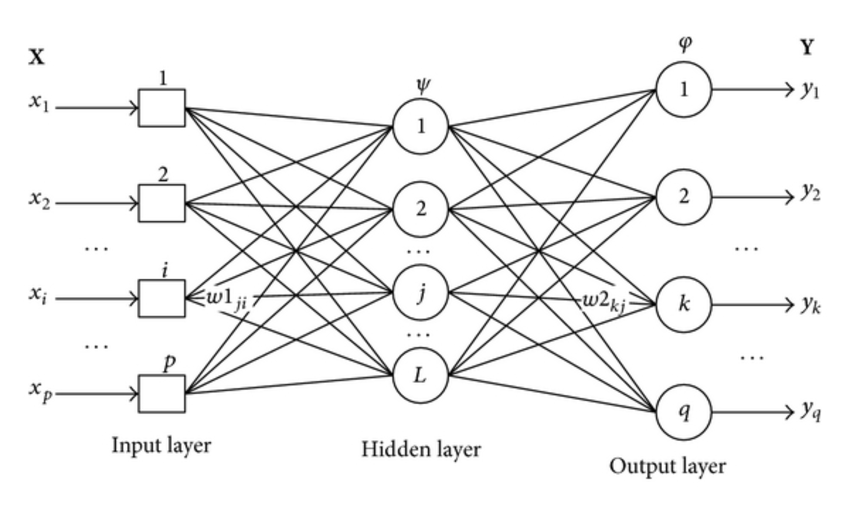

# neural_networks_101

Example of a Python single layer perceptron neural network using sklearn datasets

### Associated Workshop Slides

The accompanying slides for this repository can be found [here](https://goo.gl/eb3tF9).

### Setup 

This is a Python 3 project. You can use either the `single_layer_perceptron.py` file or spin up a Jupyter notebook.

First you'll need to create a `virtualenv` and install the requirements. These instructions presume a [Mac setup](https://gist.github.com/pandafulmanda/730a9355e088a9970b18275cb9eadef3). For windows setup follow these [instructions](http://timmyreilly.azurewebsites.net/setup-a-virtualenv-for-python-3-on-windows/). 

To start:

```
virtualenv -p python /path/to/python3 neural_networks_env
source path/to/neural_networks_env/bin/activate
(neural_networks_env) pip install -r requirements.txt
```

### Running the Python Code

Once the requirements have been installed and you've activated your `virtualenv`:

```
(neural_networks_env) python single_layer_perceptron.py
```

### Optional: Jupyter Notebook

```
(neural_networks_env) jupyter notebook
```

### Want to do more? Try these stretch exercises!

- Update your single layer perceptron to have additional layers (multilayer perceptron - MLP) e.g. three layers, [use this tutorial](https://medium.freecodecamp.org/building-a-3-layer-neural-network-from-scratch-99239c4af5d3) to help you. A three layer network starts using "hidden layers" to add intermediate nodes, that additionally interact with the activation function during forward pass / updating weights. [](Three-layer-multilayer-perceptron-MLP-neural-network.png)

- Try taking your perceptron and instead of implementing it from scratch use a Python scientific programming library like Keras instead, [use this tutorial](https://machinelearningmastery.com/tutorial-first-neural-network-python-keras/) to help you
- Reflect: What does forward propagation and backward propagation provide your NN that a single layer perceptron doesn’t have?

